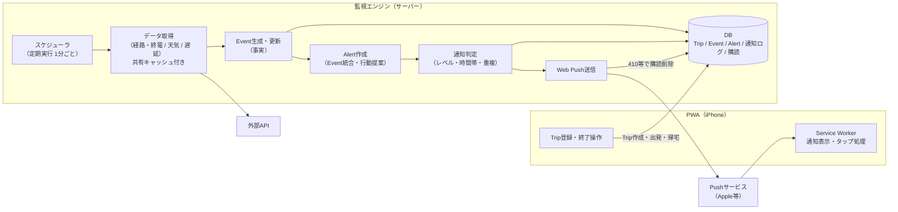
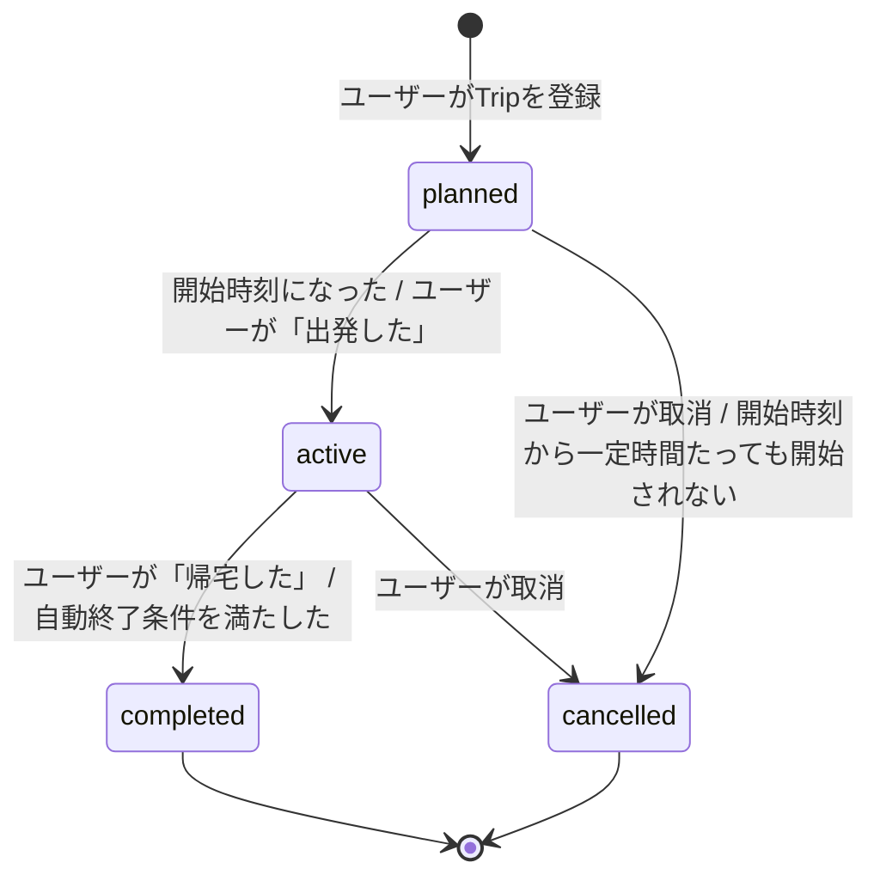
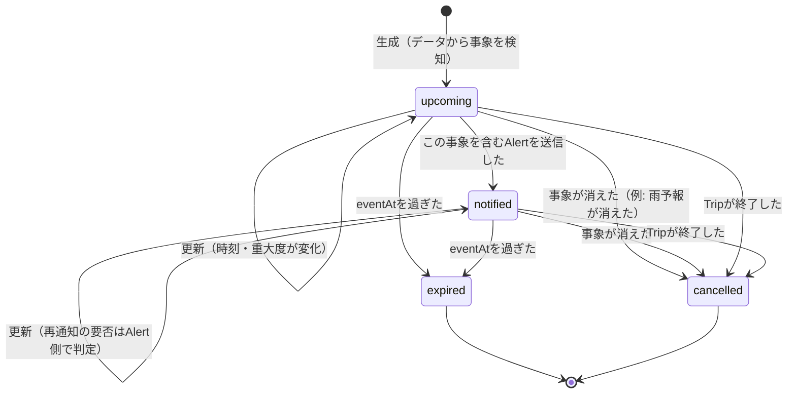
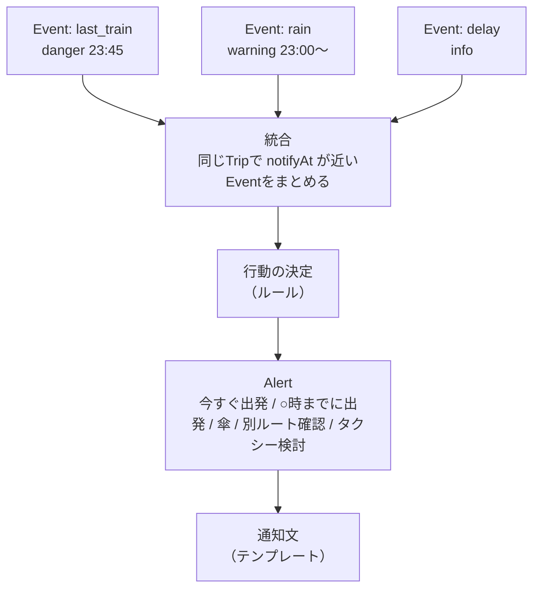
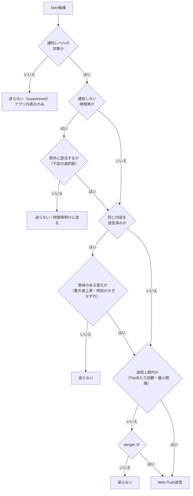
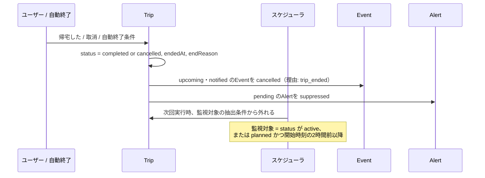

# ENGINE_DESIGN — 監視エンジン設計（フェーズ0）

フェーズ0 タスク3。**設計のみで、実装はしていません。**
実行基盤の比較は [`PLATFORM_COMPARISON.md`](./PLATFORM_COMPARISON.md)、技術的リスクは [`RISKS.md`](./RISKS.md) を参照してください。

前提（[`TECH_VALIDATION.md`](./TECH_VALIDATION.md) の調査結果より）:

- PWAはバックグラウンドで常時JavaScriptを実行できない。**監視はすべてサーバー側**で行い、必要なときだけWeb Pushを送る。
- Pushを受けたService Workerは必ず通知を表示しなければならない（Safariはサイレントプッシュ非対応）。**「送るかどうか」の判断はすべてサーバー側で完結させる。**
- バックグラウンド位置情報は使えない。距離・所要時間は**出発地点・目的地・帰宅先・登録地点**を基準に計算する。

---

## 0. 全体像



処理の流れ（1回のスケジューラ実行）:

1. 監視対象のTrip（`active`、および開始が近い `planned`）を取り出す。
2. 必要なデータを取得する。**同じ路線・同じ地域のデータはユーザー間で共有キャッシュ**し、API呼び出しを減らす。
3. データからEvent（事実）を生成・更新・取消・期限切れにする。
4. 通知時刻が近いEventをまとめ、1つのAlert（行動提案）を作る。
5. 通知判定を通ったAlertだけWeb Pushで送る。

---

## 1. Tripのライフサイクル



| 状態 | いつ始まるか | いつ終わるか | 監視 |
|---|---|---|---|
| `planned` | ユーザーがTripを登録したとき | `active` になったとき、または `cancelled` になったとき | 開始時刻の一定時間前（例: 2時間前）までは**監視しない**。それ以降は出発判断に必要なもの（出発地点の雨、出発時刻の`depart`）だけを**低頻度**で監視する |
| `active` | 開始時刻に達したとき、またはユーザーが「出発した」を押したとき | `completed` または `cancelled` になったとき | 帰宅に関わるもの（終電、帰宅ルートの遅延、目的地・帰宅先の雨）を監視する |
| `completed` | ユーザーが「帰宅した」を押したとき。または自動終了条件（下記）を満たしたとき | 終端 | **即座に停止** |
| `cancelled` | ユーザーが取消したとき。または `planned` のまま開始時刻から一定時間（例: 3時間）経過したとき | 終端 | **即座に停止** |

### 自動終了（`active` → `completed`）の条件（案）

ユーザーが「帰宅した」を押し忘れても監視（とAPI費用）が続かないようにする。

| 条件 | 例 |
|---|---|
| 帰宅予定時刻を過ぎて一定時間 | 帰宅予定時刻 + 2時間 |
| 帰宅予定時刻が未定の場合、終電時刻を過ぎて一定時間 | 終電出発 + 1時間（終電後は `taxi` 提案以外に行動を変えられないため） |
| 最大監視時間 | Trip開始から24時間（安全装置） |

- 自動終了したTripは `endReason: "auto_timeout"` などで区別する（ユーザー操作での終了と分けて分析できるようにする）。
- **仕様の不足（報告）:** 仕様には「開始されないまま時間が過ぎたplanned」の状態が無いため、`cancelled`（理由 `not_started`）として扱う案にしている。別の状態を設けるかはフェーズ1前に決める必要がある。

### Tripに必要な情報（将来仕様の案）

| 論理名 | キー案 | 型 | 必須 | 説明 |
|---|---|---|---|---|
| tripId | `tripId` | string | ○ | 例 `trip_001` |
| ユーザー | `userId` | string | ○ | |
| 出発地点 | `出発地点` | 地点 | ○ | 名前・緯度経度・最寄り駅ID（任意） |
| 目的地 | `目的地` | 地点 | ○ | 同上 |
| **帰宅先** | `帰宅先` | 地点参照 | ○ | **登録地点への参照**にしておくと、将来の複数登録（自宅・実家など）に対応しやすい。MVPは1件 |
| 帰宅予定時刻 | `帰宅予定時刻` | datetime | 任意 | 未定の扱いは「8. 帰宅予定時刻が未定の場合」 |
| 開始時刻 | `開始時刻` | datetime | ○ | 出発予定時刻 |
| 状態 | `status` | enum | ○ | `planned` / `active` / `completed` / `cancelled` |
| 通知レベル | `notifyLevel` | enum | ○ | `minimum` / `standard` / `all`（既定はユーザー設定） |
| 終了理由 | `endReason` | enum | 終了時 | `user_completed` / `user_cancelled` / `auto_timeout` / `not_started` など |
| 実際の開始・終了 | `startedAt` / `endedAt` | datetime | | |
| 作成・更新 | `createdAt` / `updatedAt` | datetime | ○ | |

- 「地点」は `{ "name": "...", "lat": 34.70, "lng": 135.49, "stationId": "..." }` のような構造。
- **決めるべき事項:** 仕様は「データ上『帰宅先』という名前」としている。JSONキーを日本語（`帰宅先`）にするか、英語キー（例 `homeDestination`）＋論理名「帰宅先」にするかは未決。上表は仕様どおり日本語キーで書いている。

---

## 2. Event

Eventは「発生している事実・未来に発生する可能性がある事象」。**Eventだけでは通知しない**（通知はAlertの役割）。

### Eventの種類（`kind`）

| kind | 意味 | `eventAt` の意味 | MVPで生成するか |
|---|---|---|---|
| `depart` | 出発すべき時刻 | 出発推奨時刻（出発時、または帰宅のために目的地を出る時刻） | ○ |
| `last_train` | 帰宅先へ帰れる最終列車 | 終電の出発時刻（目的地最寄り駅） | ○ |
| `rain` | 雨 | 雨が降り始める（または強まる）予想時刻 | ○ |
| `delay` | 帰宅ルート上の遅延・運転見合わせ | 遅延情報の発生時刻 | データ次第（[API_RESEARCH.md](./API_RESEARCH.md) 3章） |
| `crowd` | 混雑 | 混雑が予想される時刻 | ×（関西で取得手段が無い） |
| `taxi` | 公共交通で帰れない可能性 | 公共交通での帰宅が不可能になる時刻 | ○（`last_train` から導出） |

### Eventのライフサイクル



| 操作 | 条件 | 処理 |
|---|---|---|
| **生成** | 取得データから新しい事象を検知し、同じ `dedupeKey` のEventが無い | `status: upcoming` で作成。`notifyAt` を計算 |
| **更新** | 同じ `dedupeKey` のEventがあり、内容（`eventAt`・`severity`・詳細）が変わった | 上書きし `updatedAt` と `revision` を更新。変化量を記録（再通知判定に使う） |
| **取消** | 事象がデータから消えた（例: 雨予報が消えた、遅延が解消した）、またはTripが終了した | `status: cancelled`、`cancelReason` を記録 |
| **期限切れ** | 現在時刻が `eventAt`（継続型の事象は終了予想時刻）を過ぎた | `status: expired` |

- **dedupeKey:** 同じ事象を二重に作らないための鍵。例 `trip_001:last_train:梅田→三宮`、`trip_001:rain:目的地`。
- **ちらつき防止:** 雨予報が「ある→ない→ある」と揺れる場合に備え、取消は**2回連続で消えたら**確定する（ヒステリシス）。

### Eventデータモデル

仕様の構造をそのまま採用できる。運用上必要な項目を追加する案:

```json
{
  "id": "evt_001",
  "tripId": "trip_001",
  "kind": "last_train",
  "severity": "danger",
  "eventAt": "2026-09-27T23:45:00+09:00",
  "notifyAt": "2026-09-27T22:55:00+09:00",
  "status": "upcoming",
  "source": "dummy",
  "updatedAt": "2026-09-27T18:00:00+09:00",

  "dedupeKey": "trip_001:last_train:umeda-sannomiya",
  "revision": 3,
  "detail": { "line": "阪急神戸線", "from": "大阪梅田", "to": "神戸三宮" },
  "sourceFetchedAt": "2026-09-27T17:59:30+09:00",
  "cancelReason": null
}
```

| 項目 | 値 | 備考 |
|---|---|---|
| `kind` | `depart` / `crowd` / `rain` / `delay` / `last_train` / `taxi` | 仕様どおり |
| `severity` | `info` / `warning` / `danger` | 仕様どおり。**`danger` は「今動かないと帰れない・濡れる」など行動が必須のときだけ** |
| `status` | `upcoming` / `notified` / `expired` / `cancelled` | 仕様どおり |
| `source` | `dummy` / 提供元名 | 表示義務（出典表記）の判定にも使う |
| 追加: `dedupeKey` `revision` `detail` `sourceFetchedAt` `cancelReason` | | 上記の生成・更新・取消に必要 |

- **仕様の論点（報告）:** `status: notified` はEventに「通知した」という状態を持たせるため、設計原則3（EventとAlertの分離）と少し重なる。仕様どおり残しつつ、**実際の送信記録はAlert・通知ログ側を正**とする案にしている。
- **仕様の論点（報告）:** 遅延のように「すでに起きている」事象は `eventAt` が過去になり、すぐ `expired` になってしまう。継続中の事象には終了予想時刻（例 `endAt`）を持たせ、それを期限切れ判定に使う案。

### severity の目安（案）

| kind | info | warning | danger |
|---|---|---|---|
| `last_train` | 終電まで余裕あり（例 90分以上） | 余裕が少ない（例 30〜90分） | 今出ないと間に合わない（目的地から駅までの所要＋余裕を切った） |
| `rain` | 弱い雨の可能性 | 帰宅時間帯に雨 | 強い雨・警報 |
| `delay` | 平常に近い遅れ | 帰宅ルートに遅延 | 運転見合わせで終電に影響 |
| `taxi` | - | 終電に間に合わない可能性 | 公共交通で帰れないことが確定 |

数値のしきい値はフェーズ1以降に実データで調整する（ここでは例）。

---

## 3. Alert

AlertはEventそのものではなく、**複数のEventを統合した「ユーザーが何をすべきか」**。1回の通知＝1つのAlert。



### Alertデータモデル（案）

```json
{
  "id": "alt_001",
  "tripId": "trip_001",
  "eventIds": ["evt_001", "evt_002"],
  "action": "leave_now",
  "severity": "danger",
  "title": "今出れば終電に間に合います",
  "body": "23:00から雨の予報です。今出発すると雨の前に駅に着けます。",
  "url": "/trips/trip_001",
  "notifyAt": "2026-09-27T22:55:00+09:00",
  "status": "sent",
  "dedupeKey": "trip_001:leave_now:2255",
  "sentAt": "2026-09-27T22:55:04+09:00"
}
```

- `action`: `leave_now`（今すぐ出発）/ `leave_by`（○時までに出発）/ `take_umbrella` / `check_route`（別ルート確認）/ `consider_taxi` / `info_only`
- `status`: `pending` / `sent` / `suppressed`（判定で送らなかった）/ `superseded`（より新しいAlertに置き換え）/ `failed`

### 統合ルール（案）

1. 同じTripで `notifyAt` が**一定時間内（例 15分）**のEventを1つのグループにする。
2. グループ内で**最も重い `severity`** をAlertの `severity` にする。
3. 行動は優先度の高い順に1つ決め、ほかのEventは本文の補足にする。
   - 優先度の例: `taxi` > `last_train` > `delay` > `rain` > `depart` > `crowd`
4. 例:
   - `last_train`(danger) ＋ `rain`(warning, 雨は23:00から)
     → 「今出れば雨を避けて終電にも間に合います」
   - `last_train`(warning) ＋ `delay`(warning)
     → 「帰宅ルートで遅延があります。22:40までの出発をおすすめします」
   - `rain`(info) のみ → 標準レベルでは**通知しない**（アプリを開いたときの表示のみ）

---

## 4. 通知判定

原則: **ユーザーの行動が変わる可能性があるときだけ通知する。**



### 通知レベル

| レベル | 通知するもの | 想定ユーザー |
|---|---|---|
| **最小** | `danger` のみ（終電に間に合わない、公共交通で帰れない等） | 通知を極力減らしたい |
| **標準**（既定案） | `danger` と、行動が変わる `warning`（例: 出発時刻が早まる、傘が必要） | 多くのユーザー |
| **全部** | `info` も含む（ただし重複防止・上限は同じく適用） | 詳しく知りたい |

### 通知しない時間帯

ユーザーが時間帯（例 0:00〜7:00）を設定する。そこに**重大なAlert（終電を逃す等）が当たった場合**の選択肢:

| 案 | 内容 | メリット | デメリット |
|---|---|---|---|
| A. 例外なし | 時間帯中は一切送らない | ユーザー設定を厳密に守る。わかりやすい | 最も重要な終電Alertを逃し、サービスの価値が失われる |
| B. `danger` は常に例外 | `danger` だけは時間帯を無視して送る | 重要な通知は確実に届く | 「設定したのに鳴った」という不信感。`danger` の乱発で設定が無意味になる |
| C. 例外をユーザーが選ぶ | 「終電だけは時間帯中でも通知する」をTripまたは設定でON/OFF（既定ON） | 本人の意思で決められる。仕様の意図（行動が変わるときだけ）と両立 | 設定項目が増える |
| D. Trip中は時間帯を無効 | `active` なTripがある間は時間帯を適用しない | 外出中は見守りが目的なので理にかなう | 帰宅後・深夜の不要な通知を防ぐには他の仕組み（Trip自動終了）に依存 |

**提案:** **C（既定ON）**。加えて、iOSの集中モードはOS側で通知を抑制できるため、アプリの時間帯設定とOSの設定が二重になる点をUIで説明する。

### 同一内容の重複防止

- Alertの `dedupeKey` を「Trip＋行動＋対象時刻（丸め）」で作る。送信済みと同じキーなら送らない。
- 端末側: 通知の `tag` を「Trip＋行動」にし、再送時は古い通知を**置き換える**。
- Pushサービス側: Web Pushの `Topic` ヘッダー（最大32文字）で、未配信の古い通知をまとめる（[Apple Developer](https://developer.apple.com/documentation/usernotifications/sending-web-push-notifications-in-web-apps-and-browsers)、2026-09-26確認）。
- 送信上限（案）: 1Tripあたり最大5回、同一Trip内の最小間隔15分。**`danger` への格上げだけは上限・間隔の例外**。

### Event更新時の再通知

| 変化 | 再通知 |
|---|---|
| `severity` が上がった（warning→danger） | する |
| 推奨出発時刻が**10分以上早まった** | する |
| 推奨出発時刻が遅くなった（余裕が増えた） | しない（アプリ内表示のみ） |
| `severity` が下がった／事象が取消された | 原則しない。ただし直前に `danger` を送っていて状況が解消した場合は「解消した」を1回だけ送る案（行動が変わるため） |
| 軽微な変化（数分のずれ） | しない |

### 危険度による通知判定のまとめ

| severity | 最小 | 標準 | 全部 |
|---|---|---|---|
| `danger` | 送る | 送る | 送る |
| `warning` | 送らない | 行動が変わるときだけ送る | 送る |
| `info` | 送らない | 送らない | 送る（上限内） |

---

## 5. 監視間隔とAPI費用

### 前提A（仕様の基本条件）

- 監視間隔: 5分
- 1ユーザーあたり週2回Trip、1Tripあたり5時間（監視対象の全時間を5分ごとにポーリング）
- 1回の監視で呼ぶAPI: **経路・終電 1回、天気 1回、遅延 1回（計3回）**。キャッシュ共有なし。混雑はAPIが無いため0回
- 1か月 = 365/12 日 ≒ 4.345週

計算: 1Tripあたり 5時間 × 12回/時 = 60回の監視。1ユーザーあたり月 2 × 4.345 × 60 ≒ 521回の監視 → ×3 API。

| ユーザー数 | 月のTrip数 | 経路・終電 | 天気 | 遅延 | **月の合計API回数** | 1日平均 |
|---|---|---|---|---|---|---|
| 1 | 約9 | 521 | 521 | 521 | **約1,564** | 約51 |
| 100 | 約869 | 52,143 | 52,143 | 52,143 | **約156,429** | 約5,143 |
| 1,000 | 約8,690 | 521,429 | 521,429 | 521,429 | **約1,564,286** | 約51,429 |
| 10,000 | 約86,905 | 5,214,286 | 5,214,286 | 5,214,286 | **約15,642,857** | 約514,286 |

### 前提B（最適化した案）

- 経路・終電: 5分ごとには呼ばない。**Trip開始時1回 ＋ 帰宅予定（または終電）の90分前・60分前・30分前に再計算 = 1Tripあたり4回**。遅延Eventが出たときだけ追加で再計算（ここでは0回と仮定）
- 天気: **30分ごと**（Open-MeteoのJMA MSMは3時間ごと更新のため、5分ごとに取っても変わらない。[JMA API](https://open-meteo.com/en/docs/jma-api)、2026-09-26確認）→ 1Tripあたり10回。地域単位の共有キャッシュは考慮しない（考慮するとさらに減る）
- 遅延: 路線単位の情報なので**ユーザー数に関係なく全体で5分ごとに1回**取得して共有する（1回で必要な全路線を取れるAPIと仮定）→ 月 8,760回で固定

| ユーザー数 | 経路・終電 | 天気 | 遅延（共有） | **月の合計API回数** | 前提A比 |
|---|---|---|---|---|---|
| 1 | 35 | 87 | 8,760 | **約8,882** | 約5.7倍（遅延の固定費が支配的） |
| 100 | 3,476 | 8,690 | 8,760 | **約20,927** | 約13% |
| 1,000 | 34,762 | 86,905 | 8,760 | **約130,427** | 約8% |
| 10,000 | 347,619 | 869,048 | 8,760 | **約1,225,427** | 約8% |

### 費用感の参考（あくまで参考）

- 仮に経路APIを Google Routes API の Essentials（月10,000件無料、以降 $5.00/1,000件）で数えると（[pricing](https://developers.google.com/maps/billing-and-pricing/pricing)、2026-09-26確認）:
  - 1,000ユーザー・前提A: 経路 521,429件 → 超過 約511,000件 ≒ **約$2,557/月**
  - 1,000ユーザー・前提B: 経路 34,762件 → 超過 約24,800件 ≒ **約$124/月**
  - ※公共交通がどのSKUになるか、日本で使えるかは**未確認**。大口の価格帯（ボリューム割引）も考慮していない。
- 天気: Open-Meteo無料枠は1日10,000回（非商用のみ）。前提Aでは100ユーザー（1日約5,143回）で天気だけで半分を使う。
- 遅延: 商用データは見積もり（料金未確認）。

### 考察

- 5分ごとに全データを取る前提Aは、ユーザー数に比例して費用が増え、1,000ユーザー規模で現実的でない。
- **データの更新頻度に合わせて間隔を変える**（天気は予報の更新間隔、終電は時刻表なので数回）と、**費用は約1/10**になる。
- 遅延のように**路線単位で共有できるデータ**は、ユーザー数が増えても費用が増えない。
- 実際のピークは金曜・土曜の夜に集中するため、平均ではなく**同時アクティブTrip数**で上限（レート制限）を確認する必要がある。

---

## 6. Trip終了による監視停止



- **監視対象の抽出を「状態」で行う**ため、Tripが終わった瞬間から次の実行でAPI呼び出しの対象外になる（個別のタイマー削除漏れが起きない）。
- 「監視不要」の判定（案）:
  - 帰宅先に着いた（ユーザー操作）
  - 帰宅予定時刻・終電を大きく過ぎた（自動終了）
  - 最大監視時間を超えた
  - Push購読が失効していて通知を届けられない（410）→ 監視を続けても意味がないので一時停止し、アプリ起動時に再購読を案内
- **費用の観点:** API費用は「監視中のTrip時間の合計」にほぼ比例する。押し忘れによる無駄な監視（例: 5時間の予定が24時間監視）を自動終了で防ぐことが、最も効果の大きい費用削減になる。`planned` のTripを開始直前まで監視しないことも同じ効果がある。

---

## 7. 通知文: ルールベースとAI生成

| 観点 | ルールベース（テンプレート） | AI生成 |
|---|---|---|
| 正確性 | 高い。数値・時刻はデータからそのまま入る | 時刻や駅名を誤って書き換える可能性がある（検証が必要） |
| コスト | ほぼ0 | 通知ごとにモデル呼び出しの費用 |
| 応答速度 | 即時 | 生成待ちが入る。終電直前など時間が重要な場面で不利 |
| 誤通知リスク | 低い（テンプレートの範囲） | 表現の揺れ・誇張・事実と違う言い回しのリスク |
| 実装難易度 | 低い（組み合わせが増えると管理が必要） | 中〜高（プロンプト、出力検証、失敗時のフォールバック） |

**提案（設計上の提案・フェーズ0では実装しない）:** MVPは**ルールベース**。
理由: Future Alertの通知は「終電に間に合うか」という**事実の正確さが価値そのもの**で、誤りのコストが大きい。行動（`action`）の種類は限られるのでテンプレートで十分に表現できる。
AIは将来、(1) アプリ内の説明文、(2) テンプレートの文言案の作成（人が確認してから採用）など、**通知の事実部分に触れない用途**から検討するのが安全。

テンプレート例:

| action | タイトル | 本文 |
|---|---|---|
| `leave_now` | 今出れば終電に間に合います | {駅} {時刻}発が終電です。{補足} |
| `leave_by` | {時刻}までに出発しましょう | {理由}。 |
| `take_umbrella` | 帰りは雨の予報です | {時刻}ごろから雨。{補足} |
| `consider_taxi` | 終電に間に合わない可能性があります | タクシーなど別の手段を検討してください。 |

---

## 8. 帰宅予定時刻が未定の場合

| 案 | 内容 | メリット | デメリット |
|---|---|---|---|
| A. 終電を基準にする | 帰宅予定時刻＝「終電に間に合う最終出発時刻」とみなす | 入力不要。Future Alertの中心価値（終電）がそのまま使える | 終電より早く帰る人には遅すぎる通知になる。雨の通知タイミングがずれる。終電の無い帰宅先（徒歩圏・車）では使えない |
| B. 入力を促す | Trip作成時、または途中で「何時ごろ帰りますか」と聞く | 精度が上がる | 途中で聞くと**それ自体が通知になり、通知疲れ**につながる。入力の手間 |
| C. 一部機能を制限する | 帰宅予定時刻なしでは `depart`（帰りの出発）・帰宅時間帯の `rain` を出さない | 誤った通知をしない | 価値が下がる。「なぜ通知が来ないのか」がわかりにくい |

**提案:** **A＋入力画面での既定値**の組み合わせ。

1. Trip作成画面で帰宅予定時刻を任意入力にし、未入力なら「**終電まで**」を既定値として明示する（BをTrip作成時だけに限定し、途中の催促通知は送らない）。
2. 帰宅予定時刻が「終電まで」のTripでは、雨・遅延の判定対象時間を「終電出発の90分前〜終電」とする。
3. 帰宅先が鉄道で帰れない（終電の概念が無い）場合はCにして、その旨を画面に出す。

---

## 9. フェーズ1以降に決めるべき設計事項（このファイル関連）

- JSONキーを `帰宅先` にするか英語キーにするか
- 開始されなかった `planned` の扱い（`cancelled` で良いか、別状態か）
- Eventの `notified` 状態と、Alert側の送信記録のどちらを正とするか
- 継続中の事象（遅延）の終了時刻の持ち方
- 通知しない時間帯の例外（案C）の既定値
- 1Tripあたりの通知上限・最小間隔・再通知しきい値の具体値
- 監視間隔（前提Bのような可変間隔を採用するか）
