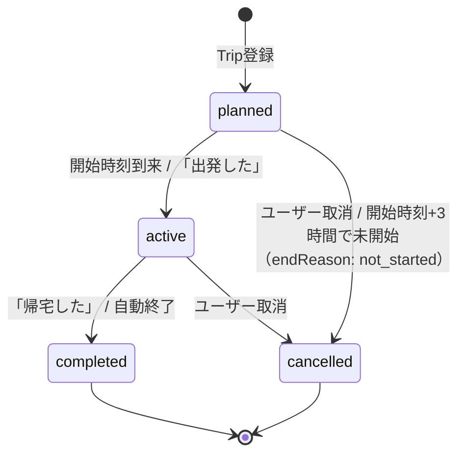
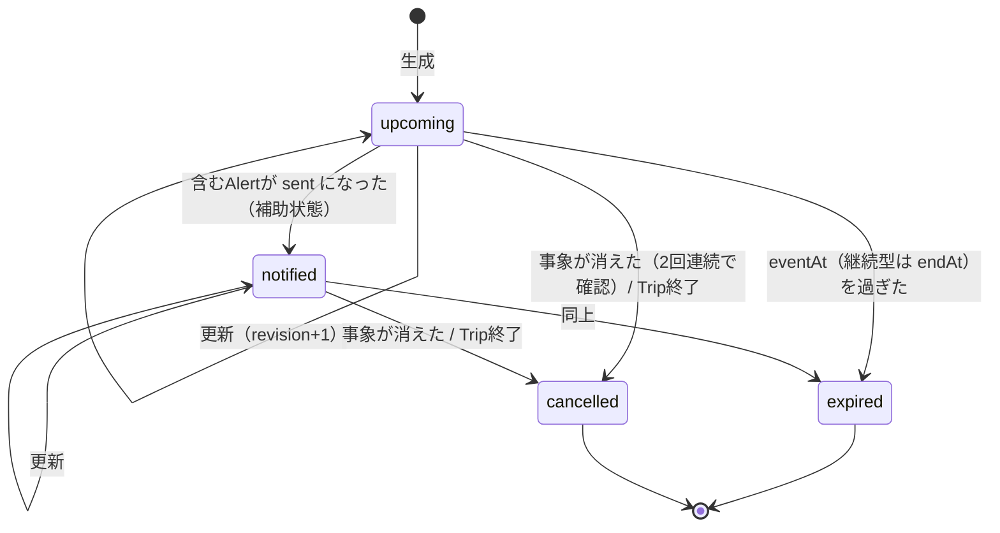
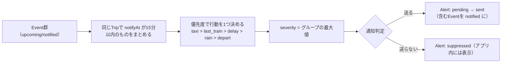
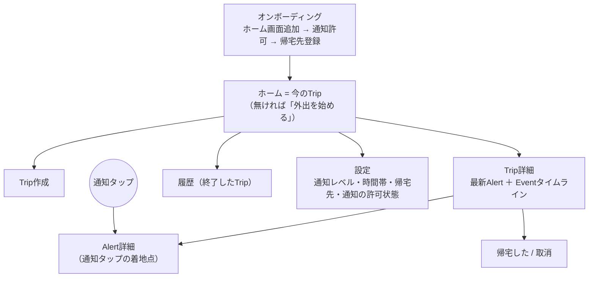

# PHASE1_DESIGN — Future Alert Phase 1 設計

- 作成日: 2026-09-27
- 状態: **設計のみ**。Phase 1の実装は未着手。
- 前提にした資料（GitHub main `70f5606`）: `CLAUDE.md`、`docs/ENGINE_DESIGN.md`、`docs/TECH_VALIDATION.md`、`docs/API_RESEARCH.md`、`docs/PLATFORM_COMPARISON.md`、`docs/RISKS.md`、`docs/PHASE0_REPORT.md`

## 決定事項（2026-09-27 たくまさん確定）

| # | 論点 | 決定 |
|---|---|---|
| D1 | 帰宅先のキー名 | 英語キー `homeDestination`。画面上の論理名は「帰宅先」 |
| D2 | Eventの `notified` | 残す。**通知送信の正はAlert側**（`status: sent`, `sentAt`） |
| D3 | 終電通知の表現 | 「間に合う見込みです」に統一（断定しない） |
| D4 | UIモックの技術 | 素のHTML/JS（フレームワークなし） |
| D5 | ダミーシナリオの舞台 | 関西 |
| D6 | データキー | **すべて英語キー**、UI表示は日本語の論理名 |
| D7 | Phase 1モックの公開先 | PoCとは**別のRenderサービス** |
| D8 | 本番URL（オリジン） | **Phase 2開始前**に決定 |
| D9 | 継続中の事象 | Eventに `endAt` を持たせる |
| D10 | 開始されなかったTrip | `cancelled`（`endReason: not_started`） |
| D11 | 同時進行Trip | **1ユーザー1件まで**。延長は帰宅予定の変更で対応 |
| D12 | タクシー | 事実はEvent `taxi`、「タクシーを検討」はAlertの `action: consider_taxi` |
| D13 | 設計書の置き場所 | `docs/PHASE1_DESIGN.md`（本書）。SPEC.mdとは別 |

以下の推奨案も本書に含めている（変更の指示があれば見直す）: 行きの出発はTripの `startAt`、帰りの出発は `depart` Event／`crowd` は型だけ残しMVPでは生成しない／Phase 1の実装＝8章のUIモック。

## 0. Phase 1 の位置づけ

**Phase 1 = Trip中心のUIモック ＋ データモデルの確定。**
画面はダミーデータ（`source: "dummy"`）だけで動かし、外部データAPI・本番監視エンジン・本番Push送信は作らない。
目的は「Trip → Event → Alert の流れがユーザーに伝わるか」を実機（iPhone PWA）で確かめること。

設計の軸:
1. 主役はTrip。画面の入口は「検索」ではなく「今のTrip」。
2. Event（事実）とAlert（行動提案）は別のデータ・別の見せ方。
3. 通知は行動が変わるときだけ。モックでも `danger` を乱用しない。
4. iPhone PWAはバックグラウンドで動けない前提。判断はサーバー側（Phase 1ではダミーの判定関数）で行い、端末は表示するだけ。

---

## 1. Tripのデータモデル

D1・D6に合わせ、**キーは英語、画面表示は日本語の論理名**とする。

```json
{
  "tripId": "trip_001",
  "userId": "user_dummy",
  "status": "active",
  "origin":          { "placeId": null, "label": "大阪駅周辺（ダミー）", "lat": 34.702, "lng": 135.495, "stationId": null },
  "destination":     { "placeId": null, "label": "京都駅周辺（ダミー）", "lat": 34.985, "lng": 135.758, "stationId": null },
  "homeDestination": { "placeId": "plc_01JDUMMYHOME", "label": "自宅（ダミー）", "lat": 34.690, "lng": 135.500, "stationId": null },
  "startAt": "2026-10-03T18:00:00+09:00",
  "plannedReturnAt": null,
  "returnMode": "until_last_train",
  "notifyLevel": "standard",
  "startedAt": "2026-10-03T18:02:00+09:00",
  "endedAt": null,
  "endReason": null,
  "createdAt": "2026-10-03T12:00:00+09:00",
  "updatedAt": "2026-10-03T18:02:00+09:00"
}
```

| キー | 論理名（画面） | 型 | 必須 | 説明 |
|---|---|---|---|---|
| `tripId` | - | string | ○ | `trip_` 接頭辞 |
| `userId` | - | string | ○ | Phase 1は固定のダミーユーザー |
| `status` | 状態 | enum | ○ | `planned` / `active` / `completed` / `cancelled` |
| `origin` | 出発地点 | PlaceSnapshot | ○ | 登録地点から選んだ場合は `placeId` あり、その場の地点なら `placeId: null` |
| `destination` | 目的地 | PlaceSnapshot | ○ | 同上 |
| `homeDestination` | **帰宅先** | PlaceSnapshot | ○ | 登録地点（Place）の `placeId` ＋ **Trip作成時点の値の写し**。MVPは1件。後でPlaceを編集・削除しても過去のTripの帰宅先は変わらない |
| `startAt` | 開始時刻 | datetime(+09:00) | ○ | 出発予定 |
| `plannedReturnAt` | 帰宅予定時刻 | datetime \| null | 任意 | 未入力なら `null` |
| `returnMode` | 帰宅予定の扱い | enum | ○ | `fixed`（時刻指定）/ `until_last_train`（終電まで。既定） |
| `notifyLevel` | 通知レベル | enum | ○ | `minimum` / `standard` / `all`。**Trip作成時にUserSettingsの値を写す**。Trip中の変更はそのTripだけに効く。**通知判定ではTripの値を使う** |
| `startedAt` / `endedAt` | 実際の開始・終了 | datetime | | |
| `endReason` | 終了理由 | enum | 終了時 | `user_completed` / `user_cancelled` / `auto_timeout` / `not_started` |

### PlaceSnapshot（地点の共通形）

`origin` / `destination` / `homeDestination` はすべて同じ形にする。

```json
{ "placeId": "plc_01JDUMMYHOME", "label": "自宅（ダミー）", "lat": 34.690, "lng": 135.500, "stationId": null }
```

| キー | 型 | 説明 |
|---|---|---|
| `placeId` | string \| null | 登録地点（Place）から選んだ場合のID。その場の地点は `null` |
| `label` | string | 表示名 |
| `lat` / `lng` | number | 緯度経度 |
| `stationId` | string \| null | 最寄り駅ID（将来の経路APIで使用） |

### 関連エンティティ

| エンティティ | 主な項目 | 理由 |
|---|---|---|
| **Place（登録地点）** | `placeId`, `userId`, `label`（自宅など）, `lat`, `lng`, `stationId` | 帰宅先を登録地点から選ぶため。バックグラウンド位置情報に頼らず登録地点基準で計算する（原則13） |
| **UserSettings** | `notifyLevel`, `quietHours`, `quietHoursLastTrainException`（既定 `true`） | 通知判定の入力。`notifyLevel` はTrip作成時の既定値としてTripへ写す |

### 共通の規則（日時・時間帯・ID）

| 対象 | 規則 |
|---|---|
| 日時 | すべてISO 8601の**オフセット付き**文字列（例 `2026-10-03T23:30:00+09:00`）。オフセットなしの日時は使わない。比較は絶対時刻で行う（実行基盤のCronはUTCのため） |
| `quietHours` | `{ "start": "HH:mm", "end": "HH:mm", "timeZone": "Asia/Tokyo" }`。`start > end` のときは日をまたぐ範囲（例 `23:00`〜`07:00`）とみなす |
| ID | `接頭辞_` ＋ 一意ID（例 ULID）。接頭辞は `trip_` / `evt_` / `alt_` / `plc_` / `user_`。**連番（`trip_001` など）はダミーデータ専用** |

### 個人情報（自宅の位置）

- **Phase 1では実在の自宅住所・座標を使わない。** 地点はすべてダミー値で、保存はメモリ上のみ（永続化しない）。
- 将来も、自宅などの座標をログに出力しない。

---

## 2. Eventのデータモデル

```json
{
  "id": "evt_001",
  "tripId": "trip_001",
  "kind": "last_train",
  "severity": "warning",
  "eventAt": "2026-10-03T23:30:00+09:00",
  "endAt": null,
  "notifyAt": "2026-10-03T22:45:00+09:00",
  "status": "upcoming",
  "source": "dummy",
  "sourceFetchedAt": "2026-10-03T21:00:00+09:00",
  "updatedAt": "2026-10-03T21:00:00+09:00",
  "dedupeKey": "trip_001:last_train:kyoto-home",
  "revision": 1,
  "detail": { "fromStation": "京都（ダミー）", "line": "ダミー線", "dataType": "timetable" },
  "cancelReason": null
}
```

| キー | 値 | Phase 1での扱い |
|---|---|---|
| `kind` | `depart` / `crowd` / `rain` / `delay` / `last_train` / `taxi` | モックで使うのは `depart` `rain` `last_train` `delay` `taxi`。`crowd` は型だけ残し生成しない |
| `severity` | `info` / `warning` / `danger` | ダミーでも `danger` は「行動しないと帰れない」場面だけ |
| `status` | `upcoming` / `notified` / `expired` / `cancelled` | D2: `notified` は残す。**Alertが `sent` になった結果として付く補助状態**で、送信の有無・時刻の判定には使わない |
| `endAt` | datetime \| null | D9: 継続中の事象（遅延など）の終了予想。期限切れ判定は `endAt` があればそれを使う |
| `detail.dataType` | `timetable` / `realtime` / `forecast` | 終電の「時刻表ベース」表示に使う |
| `source` / `sourceFetchedAt` | | 画面の「出典・最終確認時刻」表示に使う |

Eventは画面では**タイムライン上の事実**として表示するだけで、行動の文言は持たせない。

---

## 3. Alertのデータモデル

```json
{
  "id": "alt_001",
  "tripId": "trip_001",
  "eventIds": ["evt_001", "evt_002"],
  "action": "leave_by",
  "severity": "warning",
  "title": "22:50までに出発しましょう",
  "body": "23:00ごろから雨の予報です。22:50までに出れば終電に間に合う見込みです（時刻表・21:00時点）。",
  "url": "/#/trips/trip_001/alerts/alt_001",
  "notifyAt": "2026-10-03T22:45:00+09:00",
  "status": "pending",
  "dedupeKey": "trip_001:leave_by:2250",
  "supersedes": null,
  "decision": { "notify": true, "reason": "standard_level_warning_action_change" },
  "sentAt": null,
  "createdAt": "2026-10-03T21:00:00+09:00"
}
```

| キー | 値 | 備考 |
|---|---|---|
| `action` | `leave_now` / `leave_by` / `take_umbrella` / `check_route` / `consider_taxi` / `info_only` | 1つのAlertに行動は1つ |
| `severity` | 含むEventの最大値 | |
| `status` | `pending` / `sent` / `suppressed` / `superseded` / `failed` | **D2: 通知したかどうかの正はここ**（`sent` ＋ `sentAt`） |
| `supersedes` | alertId \| null | 更新で置き換えた旧Alertを辿る |
| `decision` | `{notify, reason}` | 通知した／しなかった理由を記録し、画面にも出せるようにする |
| `url` | 同一オリジンのハッシュ形式URL | **`/#/trips/{tripId}/alerts/{alertId}` に統一**（静的配信でもファイルが無く404にならないように）。PoCの `sw.js` と同じく同一オリジンのみ |

---

## 4. Tripの状態遷移



| 遷移 | トリガー | 監視 |
|---|---|---|
| 登録 → `planned` | 作成画面で保存 | 開始2時間前までは監視しない |
| `planned` → `active` | 開始時刻（サーバー判定）または「出発した」ボタン | 帰宅関連の監視開始 |
| `active` → `completed` | 「帰宅した」ボタン、または自動終了（帰宅予定+2時間 / 終電+1時間 / 最大24時間） | 即停止、未送信Alertは `suppressed` |
| → `cancelled` | 取消ボタン、または未開始のまま開始+3時間 | 即停止 |

- D11: 同時に `active` なTripは1ユーザー1件まで。延長は帰宅予定（`plannedReturnAt` / `returnMode`）の変更で対応する。
- Phase 1のモックでは、時刻による遷移は「時刻を進める」操作で再現する。

---

## 5. Eventの状態遷移



- D2: `upcoming → notified` は**Alert側の `sent` から一方向に反映**する。Event側の `notified` を見て「送信済みだから送らない」と判断してはいけない（重複防止はAlertの `dedupeKey` と送信記録で行う）。

---

## 6. Alert生成の基本ルール



1. **通知は行動が変わるときだけ。** 行動が変わらない事実（例: 弱い雨の可能性）は、**Tripの `notifyLevel` が `all` のときに限り** `action: info_only` のAlertを作る。`minimum` / `standard` ではAlertを作らず、タイムライン表示のみ。
2. 統合: 同一Trip・`notifyAt` 15分以内のEventを1つのAlertに。
3. 行動の決定とテンプレート（D3: 終電は「見込み」で統一）:

| 含まれるEvent | action | タイトル | 本文テンプレート |
|---|---|---|---|
| `last_train`(danger) | `leave_now` | 今出れば終電に間に合う見込みです | {駅} {時刻}発が終電です（{データ種別}・{確認時刻}時点）。 |
| `last_train`(warning) ＋ `rain`(warning) | `leave_by` | {時刻}までに出発しましょう | {雨の時刻}ごろから雨の予報です。{時刻}までに出れば終電に間に合う見込みです（{データ種別}・{確認時刻}時点）。 |
| `rain`(warning) のみ | `take_umbrella` | 帰りは雨の予報です | {時刻}ごろから雨の予報です。 |
| `delay`(warning) | `check_route` | 帰宅ルートで遅延があります | 公式の運行情報を確認してください。 |
| `taxi`(danger) | `consider_taxi` | 終電に間に合わない可能性があります | タクシーなど別の手段を検討してください。 |
| 行動が変わらないinfoのみ（`notifyLevel: all` のときだけ） | `info_only` | {事実の要約} | {詳細}。行動の変更は不要です。 |

   - 禁止表現: 「間に合います」「大丈夫です」など到着を保証する断定。
4. 通知判定（Tripの `notifyLevel` を使う）: レベル（最小=dangerのみ / 標準=danger＋行動が変わるwarning / 全部=それに加えて `info_only`）、通知しない時間帯（終電のみ例外・既定ON）、重複防止（Alertの `dedupeKey`・通知 `tag`・Push `Topic`）、1Trip最大5回・最小間隔15分（danger格上げは例外）。
5. 再通知: 重大度上昇、推奨出発時刻が10分以上早まったときだけ。遅くなった・下がったときは画面更新のみ（直前にdangerを送っていて解消した場合のみ「解消」を1回）。

---

## 7. Trip中心の画面構成



| 画面 | 役割 | 主な表示 |
|---|---|---|
| オンボーディング | iPhoneの制約（ホーム画面追加・ユーザー操作での許可）を最初に通す | 手順、「通知を許可する」ボタン、帰宅先の登録（ダミー候補から選択※） |
| **ホーム（今のTrip）** | 開いたら「今どうすべきか」が1画面で分かる | 状態、最新のAlert（行動）を最上部に1つ、次のEvent、終電（時刻表・確認時刻）、「帰宅した」ボタン |
| Trip作成 | 最小入力で開始 | 目的地、開始時刻（既定: 今）、帰宅先（既定: 登録済み。変更もダミー候補から選択※）、帰宅予定（既定: 終電まで） |
| Trip詳細 | 事実の一覧 | Eventタイムライン（事実のみ）、出典・確認時刻、Alert履歴（送った／送らなかった理由） |
| Alert詳細 | 通知から開く画面。アニメーションなしで即表示 | 行動（大きく）、根拠のEvent、公式運行情報へのリンク |
| 履歴 | 終了したTrip | 日付・終了理由 |
| 設定 | 通知の量をユーザーが決める | 通知レベル、通知しない時間帯と終電例外、帰宅先（ダミー候補から選択※）、**通知の許可状態（`Notification.permission`）のみ実データ**。購読状態と「最後に通知が届いた時刻」は**ダミー表示**（実装はPhase 2） |

※ 帰宅先の入力（オンボーディング・Trip作成・設定で共通）: Phase 1では帰宅先を**ダミー候補（例: 大阪市内（ダミー））から選ぶだけ**とし、住所・座標の自由入力欄は設けない。

表示の原則:
- Alert（行動）はカード1枚、Event（事実）は時系列の行で、視覚的に分ける。
- 見守りが止まっている・データが古い場合はホームに明示する。
- モックでは全画面に「ダミーデータ」表示を常に出す。
- `prefers-reduced-motion` 対応、`backdrop-filter` の多用禁止。

---

## 8. Phase 1で作るUIモックの範囲

### 技術構成（D4: 素のHTML/JS）

| 項目 | 方針 |
|---|---|
| 言語 | HTML / CSS / JavaScript（ES Modules）。ビルド工程・フレームワークなし |
| 画面遷移 | 1つの `index.html` ＋ `location.hash`（例 `#/trips/trip_001/alerts/alt_001`）で切り替え |
| データ | ダミーJSON（シナリオごと）をJSで読み込む。保存はメモリ上のみ（必要ならlocalStorageは表示設定程度） |
| 判定ロジック | 6章のルールを**DOMに依存しない純粋関数のモジュール**（例 `engine/decide.js`）に分離。将来サーバーでも再利用できる形にする |
| PWA | `manifest.json`（`display: standalone`）、アイコン、`sw.js`（通知表示とタップ遷移のみ。オフラインキャッシュは不要） |
| 置き場所 | `app/`（案）。`poc/push/` とは別 |

補足: iOSのホーム画面PWAでハッシュ遷移が問題なく動くかは、モック作成時に実機で確認する（未確認）。

### ダミーシナリオ（D5: 関西）

駅名・地名は実在のものを使うが、**時刻・路線・遅延はすべてダミー**とし、画面と通知に「ダミー」を明記する（実在の終電時刻と誤解させないため）。

| # | シナリオ | 内容 | 期待する通知 |
|---|---|---|---|
| S1 | 平穏 | 大阪駅周辺 → 京都駅周辺、帰宅先は大阪市内。雨なし・遅延なし | **通知なし**（Trip詳細に終電と天気の事実だけ表示） |
| S2 | 雨＋終電 | 神戸三宮周辺で外出、帰宅先は大阪市内。23時ごろから雨、終電に余裕が少ない | `leave_by`（warning）を**1回** |
| S3 | 遅延で終電危機 | 京都駅周辺で外出、帰宅先は大阪市内。帰宅ルートに遅延発生 → 終電が危うい → 間に合わない | `check_route`（warning）→ `leave_now`（danger）→ `consider_taxi`（danger）。最大3回 |

### その他のモック機能

| 機能 | 内容 |
|---|---|
| 7画面 | 7章のとおり、ダミーデータで遷移できる |
| 「時刻を進める」デバッグ操作 | Trip/Event/Alertの状態遷移を画面で再現（本番の監視エンジンの代わり） |
| 端末内の通知表示確認 | `showNotification` でAlert詳細への遷移を確認（サーバーPushは使わない） |
| Push購読 | **実装しない**（`pushManager.subscribe` を呼ばない。VAPID公開鍵も使わない） |

### モック通知の限界（本番Push検証とは別）

- モックの通知は、**アプリを前面に開いて操作している間の再現のみ**。iPhone PWAはバックグラウンドでJSが動かないため、「時刻を進める」操作で出る通知はアプリ表示中にしか出ない。
- **アプリを閉じた状態・画面ロック中の受信は、モックでは検証しない。** これはPhase 0の実機テスト（TECH_VALIDATION 4章）で確認済みで、本番の通知での検証はPhase 2で行う。
- D7によりモックはPoCと別オリジンになるため、iPhoneのホーム画面には**PoCとモックの2つのアイコン**が並ぶ。名前を区別する（PoC「FA PoC」、モック「FA Mock」）。

**完了条件（案）:** iPhoneのホーム画面PWAで3シナリオを操作し、「通知はいつ・何回来るか」「タップ後に何をすべきか分かるか」をたくまさんが判断できること。

---

## 9. Phase 1ではまだ実装しないもの

- 外部データAPI（経路・終電・天気・遅延・混雑）への接続
- 本番監視エンジン（定期実行・API取得・本番Event生成）
- 本番DB・ユーザー認証・複数ユーザー
- サーバーからの本番Push送信（Phase 0 PoCは現状のまま残す）
- 本番実行基盤（Supabase等）の構築
- 位置情報の取得
- 実在の自宅住所・座標の入力・保存（Phase 1はダミー値・メモリ上のみ）
- Push購読（`pushManager.subscribe`）と購読情報の保存
- 課金・広告・利用規約／免責の正式文面
- AIによる通知文生成

---

## 10. Phase 2以降へ残すもの

| Phase 2 候補 | Phase 3以降 |
|---|---|
| 実行基盤の技術検証（Supabase Edge Functions / Cloudflare Workers で web-push が動くか） | 遅延データ（有料）の導入判断 |
| 本番DB・認証・購読の保存（Render無料のファイル保存は使わない） | 混雑（首都圏のみNAVITIME等） |
| 経路・終電APIの1社採用と規約確認（駅すぱあと／NAVITIME／Google） | 帰宅先の複数登録 |
| 天気API（Open-Meteo 非商用で開始か） | AIによる補助的な文言 |
| 監視エンジン（可変間隔＋共有キャッシュ） | 地域拡張 |
| 本番Push送信と失効処理、死活監視・「見守り停止中」表示 | 端末内予約通知による二重化（可否が未確認） |

---

## 11. Phase 0 のWeb Push PoCとの接続方法

**方針: PoCは変更せず「仕様の見本」と「回帰確認用」として残す。Phase 1のモックはPoCに依存しない。**

| 要素 | 接続のしかた |
|---|---|
| コード | `poc/push/` は触らない。Phase 1は `app/`（案）。PoCの実装パターン（ユーザー操作での許可、`sw.js` のルート配信、同一オリジンURLのみ開く、`tag` での置き換え）を設計として踏襲 |
| 購読API | Phase 2の本番サーバーで `POST /subscribe` の入出力形式（PushSubscription JSON）を互換にする。PoCの `subscriptions.json` 方式は引き継がない |
| 通知ペイロード | **Phase 2の本番ペイロード**は、PoCの形式 `{title, body, url, tag, sentAt}` を土台に `{tripId, alertId, action, severity}` を追加する案。4KB以内。**Phase 0のPoC自体（`poc/push/` のコード・ペイロード）は変更しない** |
| 通知タップ | `url` はAlert詳細（`/#/trips/{tripId}/alerts/{alertId}`）。PoCの「既存ウィンドウがあれば移動、なければ開く」を使う |
| Render | 既存のPoCサービスはそのまま。D7: モックは**別のRenderサービス**で公開（静的配信）。本番URLはD8のとおりPhase 2開始前に決める |
| 秘密情報 | Phase 1モックはVAPID鍵もADMIN_TOKENも使わない |

---

## 12. 既存資料との関係と残る確認事項

### 既存資料との関係

| 既存資料の記述 | 本書での扱い |
|---|---|
| ENGINE_DESIGN: Tripのキー案が日本語（`帰宅先` 等） | D1・D6で英語キーに変更（論理名は日本語のまま） |
| ENGINE_DESIGN: Eventの `status` に `notified` | D2で残す。送信の正はAlert |
| ENGINE_DESIGN: 継続中の事象の終了時刻は「案」 | D9で `endAt` として確定 |
| ENGINE_DESIGN: 未開始の `planned` は `cancelled` 案 | D10で確定 |
| 仕様の文例「終電にも間に合います」 | D3で「間に合う見込みです」に統一 |
| ENGINE_DESIGN 3章のAlert例・7章のテンプレート（`leave_now` の「今出れば終電に間に合います」） | D3で「今出れば終電に間に合う見込みです」に置き換え。Phase 1以降のテンプレートは本書6章を使う |
| ENGINE_DESIGN: 地点は「名前・緯度経度・最寄り駅ID」、帰宅先は登録地点への参照 | `PlaceSnapshot` に統一（帰宅先も値の写しを持つ） |
| ENGINE_DESIGN: Alertの `url` 例は `/trips/trip_001` | ハッシュ形式 `/#/trips/{tripId}/alerts/{alertId}` に統一 |
| ENGINE_DESIGN: 通知レベル「全部」は info も含む | `notifyLevel: all` のときだけ `info_only` Alertを作ると明確化 |
| （本書で追加した項目） | Tripの `returnMode`、エンティティ `Place` / `UserSettings`、`PlaceSnapshot`、Eventの `detail.dataType` / `sourceFetchedAt`、Alertの `supersedes` / `decision`、日時・`quietHours`・IDの規則 |
| ENGINE_DESIGN: `taxi` はEventのkind | D12で、事実はEvent・行動はAlertと整理 |

既存のPhase 0資料（`docs/ENGINE_DESIGN.md` ほか）は変更していない。Phase 1以降は、上表の点について**本書を優先**する（ENGINE_DESIGNの断定表現もD3に合わせて読み替える）。

### 残る確認事項（Phase 1実装時に確認）

| # | 内容 |
|---|---|
| C1 | iOSのホーム画面PWAでハッシュによる画面遷移と、通知タップからハッシュ付きURLを開く動作が問題ないか（実機で確認） |
| C2 | モック用Renderサービスの種類（Static Site か Web Service か）と名前 |
| C3 | 本番URL（独自ドメインを取るか）— Phase 2開始前に決定（D8） |
